# solana-alert-bot-guide
> A step-by-step guide to build a Solana Alert Bot with Helius, Vercel, GitHub (or another GIT provider), and Discord.

No code skills required, less than 15 minutes, free and open source.

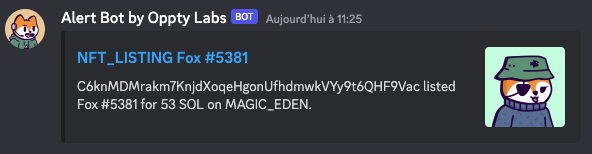

## Use cases
Use this guide to build ;
- a listing alert bot on a collection or a NFT
- a sales bot on a collection or a NFT
- a sales bot on your wallet, ie get a notification when your NFT is sold

## Let's go

### Create a Webhook on your Discord server
You need your own Discord server or be admin.

Then follow steps of the ``MAKING A WEBHOOK`` section of this [Discord Support Article](https://support.discord.com/hc/en-us/articles/228383668-Intro-to-Webhooks)

Don't forget to save Webhook URL, we will use it later.

### Deploy on Vercel
Sign up for a free account on [Vercel](https://vercel.com/signup).

Vercel will host our alert bot code.

1. **Add new Project**

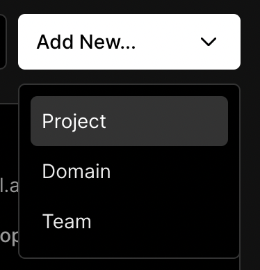

2. Select **Import Third-Party Git Repository**

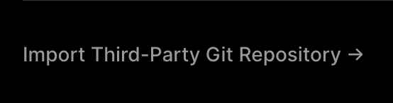

3. **Paste the URL of this repository**

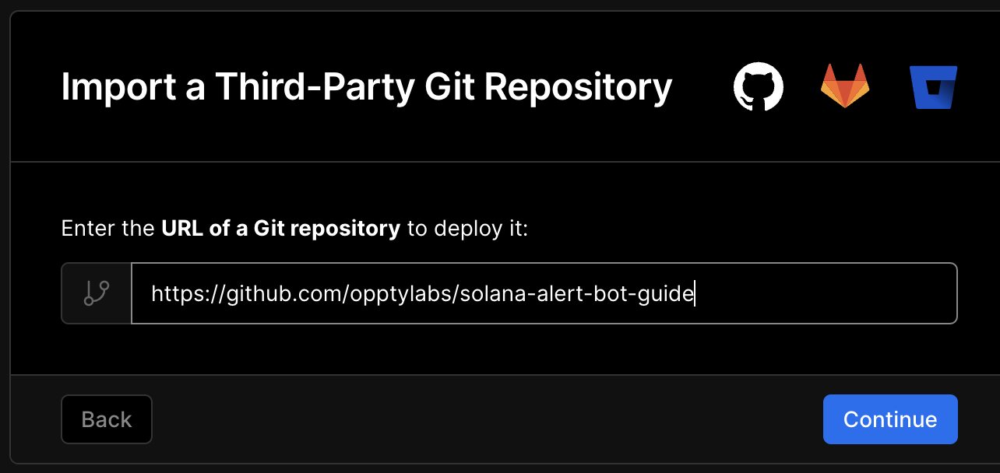

> https://github.com/opptylabs/solana-alert-bot-guide

4. **Create Git Repository** with GitHub or your favorite Git provider

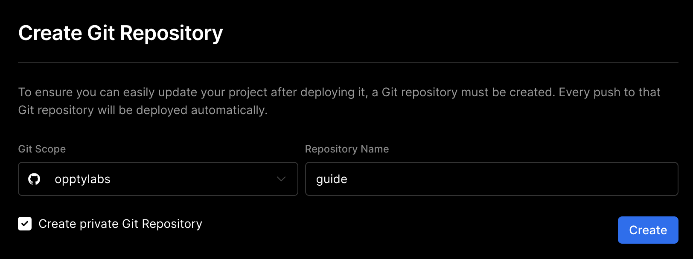

5. After a few seconds, click on **Continue to Dashboard**

6. Go to Settings > Environment Variables

7. **Add DISCORD_WEBHOOK_URL** Key, with your Discord Webhook URL as Value

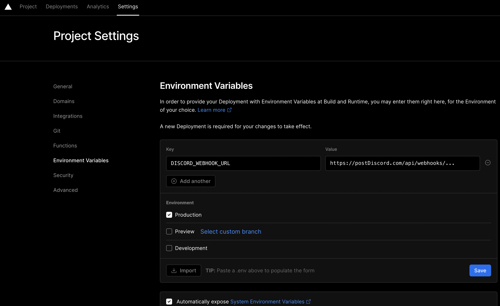

8. Get project URL and save it for later

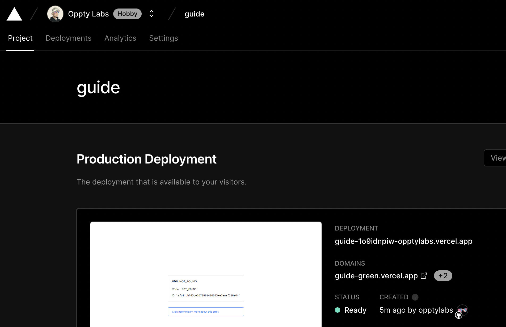

### Create Helius Webhook

1. Go to [Helius Dashboard](https://dev.helius.xyz/dashboard/app)
2. Connect Wallet
3. Generate API Key

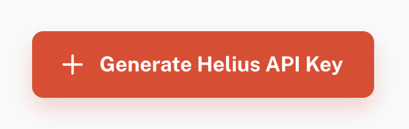

4. Copy API Key and save it for later

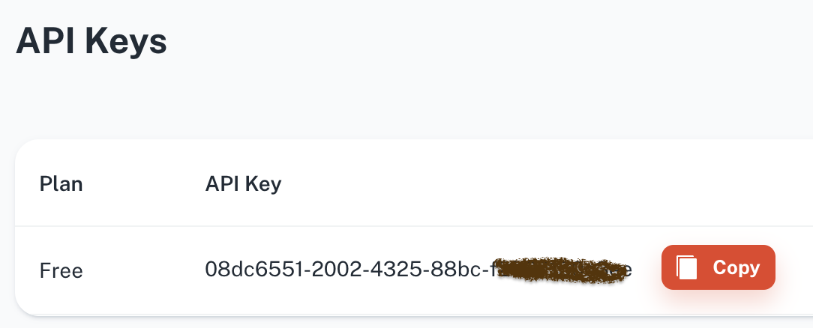

5. Create Webhook

6. Configure Webhook

    - Choose [Transaction Types](https://docs.helius.xyz/api-reference/transaction-types), here we selected NFT_SALE, NFT_LISTING, and NFT_MINT
    - Add Webhook URL : use your Vercel project URL, add `api/webhook` in the end
    - Add Addresses : you can add as many addresses as you want : to easily get an NFT or collection address, go to the NFT page on Magic Eden and copy `Mint address` to follow one NFT, `On-chain Collection` to follow an entire collection, or simply your wallet to follow your transactions.

      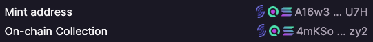

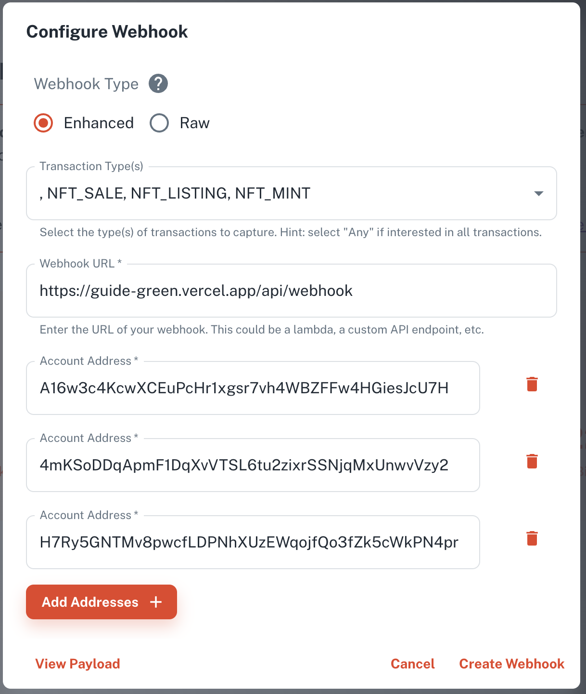

Helius offers one webhook per free account, but you can use it for multiple collections or NFTs. Upgrade to paid plans if you need more.

### Optional - get NFT metadata to display image
> This optional step will allow your webhook to retrieve NFT metadatas, and display image on Discord.

Go back to Vercel dashboard an add HELIUS_API_KEY as environment variable.

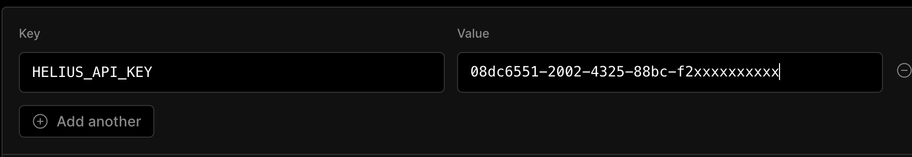

## Enjoy
Need help to complete this guide ? Ask me on Twitter [@0xOppty](https://twitter.com/0xOppty)

Support us by ;
* sharing
* tipping oppty.sol
* contributing, this guide is open source